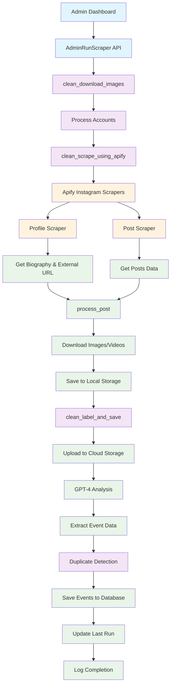
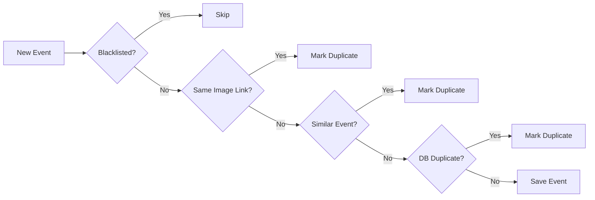
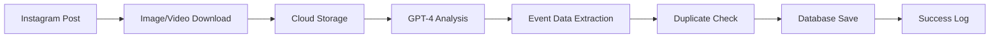

# Instagram Event Scraper Architecture Diagram

## Overview
This diagram shows how the Instagram Event Scraper works to extract, process, and save event information from Instagram posts.

## Main Flow

## Detailed Component Breakdown

### 1. Entry Point
- **AdminRunScraper API**: Receives list of Instagram accounts to scrape
- **clean_download_images**: Main orchestrator function

### 2. Data Extraction (Apify)
- **Profile Scraper**: Extracts account biography and external links
- **Post Scraper**: Gets recent posts with images/videos
- **process_post**: Handles individual posts (Image/Sidecar/Video)

### 3. Media Processing
- **Download Functions**: 
  - `download_and_save_image()` for images
  - `download_and_save_first_frame()` for videos
- **Blacklist Check**: Skips previously processed URLs
- **Local Storage**: Saves to `posters/{account}/{shortcode}.jpeg`

### 4. AI Analysis
- **saveImage()**: Uploads to cloud storage
- **label_using_gpt4()**: Analyzes image + caption + biography
- **Extracted Data**: Event name, venue, dates, artists, prices, etc.

### 5. Event Processing
- **Duplicate Detection**:
  - Same image link → mark as duplicate
  - Similar events (fuzzy matching) → mark as duplicate
  - Database check → mark as duplicate
- **Data Quality**: Minimum threshold for required fields
- **Event Creation**: Structured event objects

### 6. Data Persistence
- **save_events()**: POST to API endpoint
- **update_last_run()**: Track last successful scrape
- **Logging**: Comprehensive logging throughout process

## Key Features

### Duplicate Prevention

### Error Handling
- **Retry Logic**: 3-5 attempts with exponential backoff
- **Graceful Degradation**: Continue processing other accounts if one fails
- **Comprehensive Logging**: Track every step and failure

### Data Flow

## Configuration

### Environment Variables
- `APIFY_API_KEY`: For Instagram scraping
- `OPENAI_API_KEY`: For GPT-4 analysis

### API Endpoints
- `ADMIN_CREATE_EVENT_ENDPOINT`: Save events
- `IMAGE_UPLOAD_CLOUD_FUNCTION_URL`: Upload images
- `ADMIN_CONFIG_ENDPOINT`: Configuration management

## Performance Optimizations

### Parallel Processing
- **ThreadPoolExecutor**: 5 workers for image processing
- **Concurrent Downloads**: Multiple images processed simultaneously

### Caching
- **Last Run Tracking**: Skip already processed posts
- **Blacklist**: Prevent reprocessing same URLs
- **Database Checks**: Avoid duplicate events

## Error Recovery

### Retry Mechanisms
- **Image Downloads**: 5 attempts, 15s wait
- **GPT-4 Calls**: 3 attempts, 8-minute wait
- **API Calls**: 3 attempts, 10s wait

### Fallback Strategies
- **Failed Scraping**: Log and continue with next account
- **Failed Analysis**: Mark as non-event
- **Failed Upload**: Skip and continue

## Monitoring & Logging

### Log Types
- **Step Progressed**: Normal operation
- **Step Completed**: Successful operations
- **Step Failed**: Errors with traceback
- **Sub Progress**: Account-level progress
- **Overall Completion**: Final summary

### Metrics Tracked
- Number of accounts processed
- Number of new events found
- Processing time per account
- Success/failure rates 